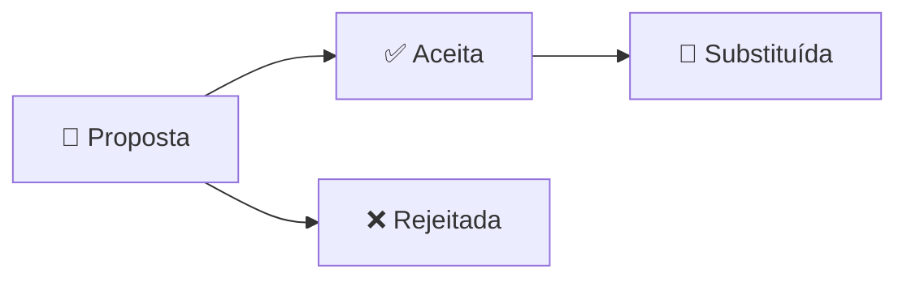

# Decisões Arquiteturais

Registro das decisões técnicas significativas da plataforma **Conexão Solidária** no formato **Architecture Decision Records (ADR)**. Cada ADR documenta o contexto, a decisão tomada e suas consequências, servindo como referência histórica para o time de engenharia.

Todas as decisões foram derivadas da modelagem de domínio realizada via [Event Storming](../../../modelagem/event-storming.md), que identificou 4 bounded contexts, 3 agregados, 23 eventos de domínio e 9 hot spots.

---

## Ciclo de Vida de um ADR

| Status | Descrição |
|--------|-----------|
| **Proposta** | Decisão em discussão, ainda não aceita pelo time |
| **Aceita** | Decisão aprovada e em vigor |
| **Substituída** | Decisão foi substituída por outra ADR |
| **Rejeitada** | Decisão avaliada e rejeitada |

---

## Índice de ADRs

| ADR | Título | Status |
|-----|--------|--------|
| [ADR-01](registros/adr-01-stack.md) | Stack Tecnológica | ✅ Aceita |
| [ADR-02](registros/adr-02-microsservicos.md) | Divisão de Microsserviços | ✅ Aceita |
| [ADR-03](registros/adr-03-arquitetura-interna.md) | Arquitetura Interna dos Serviços | ✅ Aceita |
| [ADR-04](registros/adr-04-persistencia.md) | Persistência de Dados | ✅ Aceita |
| [ADR-05](registros/adr-05-mensageria.md) | Mensageria e Comunicação Assíncrona | ✅ Aceita |
| [ADR-06](registros/adr-06-autenticacao.md) | Autenticação e Autorização Cross-Service | ✅ Aceita |
| [ADR-07](registros/adr-07-api-gateway.md) | API Gateway | ✅ Aceita |
| [ADR-08](registros/adr-08-observabilidade.md) | Observabilidade | ✅ Aceita |
| [ADR-09](registros/adr-09-infraestrutura.md) | Infraestrutura e Deploy | ✅ Aceita |
| [ADR-10](registros/adr-10-testes.md) | Estratégia de Testes | ✅ Aceita |

> **Data:** Março 2026 · **Autores:** Equipe Hackathon 9NETT — ONG Esperança Solidária
