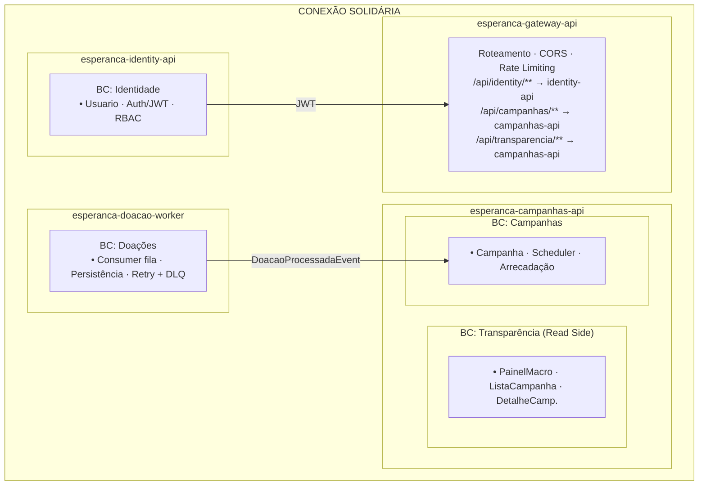

# ADR-02 — Divisão de Microsserviços

> **Data:** Março 2026 · **Status:** ✅ Aceita

---

## Contexto

O Event Storming identificou 4 bounded contexts — **Identidade**, **Campanhas**, **Doações** e **Transparência** — com padrões de comunicação distintos:

- Identidade é autocontido (emite JWT consumido por todos)
- Campanhas gerencia ciclo de vida e consome `DoacaoProcessadaEvent`
- Doações tem processamento assíncrono via Worker
- Transparência é somente leitura (Read Models projetados de eventos dos demais contextos)

## Decisão

Dividir em **3 microsserviços + 1 API Gateway**:

| Serviço | Tipo | Bounded Context(s) | Responsabilidade |
|---------|------|---------------------|------------------|
| `esperanca-identity-api` | ASP.NET Core Web API | Identidade | Registro, autenticação (JWT), RBAC, gestão de perfis |
| `esperanca-campanhas-api` | ASP.NET Core Web API | Campanhas + Transparência | CRUD de campanhas, ciclo de vida, scheduler, painel de transparência, consumer de `DoacaoProcessadaEvent` |
| `esperanca-doacao-worker` | .NET Worker Service | Doações | Consumo de `DoacaoRecebidaEvent`, persistência no MongoDB, publicação de `DoacaoProcessadaEvent`, retry/DLQ |
| `esperanca-gateway-api` | API Gateway | Roteamento | Proxy reverso, roteamento, CORS, rate limiting |

**Repositórios:** um repositório separado por microsserviço (4 repos no total).

## Diagrama — Bounded Contexts → Serviços

## Justificativa

1. **Transparência acoplada a Campanhas:** subdomínio exclusivamente de leitura que depende dos dados de campanhas e doações processadas — separá-lo criaria um serviço sem lógica de escrita
2. **Worker isolado:** processamento assíncrono com padrão de falha distinto (retry + DLQ); isolamento permite scaling horizontal independente
3. **Identity isolado:** cross-cutting concern crítico; deploy e scaling independentes
4. **3 serviços (não 4):** equipe de 4 pessoas e prazo de 50 dias — equilíbrio entre separação de responsabilidades e viabilidade operacional

## Alternativas Consideradas

| Alternativa | Motivo da Rejeição |
|-------------|-------------------|
| **4 serviços** (Transparência separada) | Overhead operacional sem benefício proporcional para o MVP |
| **Monolito modular** | Não atende ao requisito do hackathon; impossibilita scaling independente do Worker |
| **2 serviços** (Identity + tudo junto) | Viola princípio de responsabilidade única; Worker acoplado à API |

## Consequências

- **Positivas:** deploy, scaling e monitoramento independentes; separação clara de responsabilidades
- **Negativas:** comunicação assíncrona exige mensageria; complexidade operacional maior; necessidade de shared JWT key
