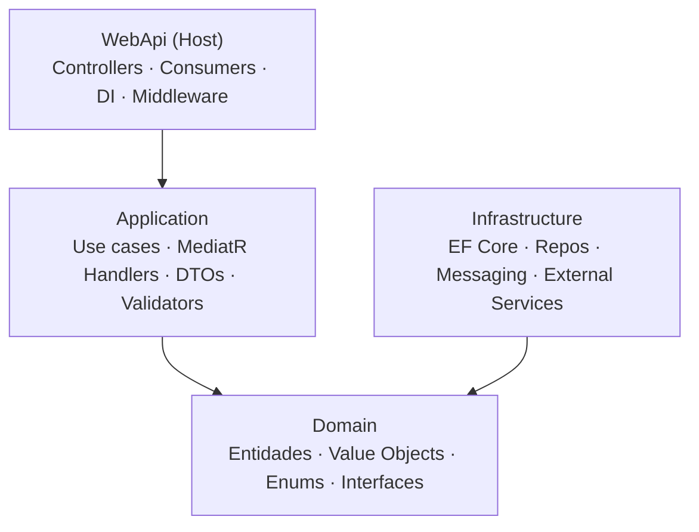

# ADR-03 — Arquitetura Interna dos Serviços

> **Data:** Março 2026 · **Status:** ✅ Aceita

---

## Contexto

Cada microsserviço precisa de uma organização interna que permita testabilidade, separação entre regras de negócio e infraestrutura, e que acomode múltiplos casos de uso sem degeneração. O Event Storming revelou casos de uso bem delimitados (`CriarCampanha`, `AtivarCampanha`, `EnviarIntencaoDoacao`) que se beneficiam de organização por feature.

## Decisão

Adotar **Clean Architecture** (4 camadas) com **Vertical Slice** para organização interna dos casos de uso na camada Application.

### Camadas

**Regra de dependência:** camadas internas nunca referenciam camadas externas. Domain não conhece Infrastructure.

### Vertical Slice na Application

Cada caso de uso é uma pasta autocontida com `Command/Query`, `Handler` e `Validator`.

## Justificativa

1. **Clean Architecture** garante que o domínio seja independente de frameworks e testável em isolamento
2. **Vertical Slice** evita o problema de camadas horizontais onde uma alteração toca múltiplas pastas desconexas — cada feature é coesa e localizada
3. **MediatR** desacopla controllers dos handlers e facilita pipeline de cross-cutting concerns (validação, logging) via `IPipelineBehavior`

## Alternativas Consideradas

| Alternativa | Motivo da Rejeição |
|-------------|-------------------|
| **Layered Architecture pura** | Casos de uso espalhados por múltiplas pastas dificultam navegação |
| **Hexagonal Architecture** | Semanticamente equivalente; nomenclatura adicional sem benefício prático |
| **CQRS completo** (write/read DBs separadas) | Overengineering para o MVP |

## Consequências

- **Positivas:** alta coesão por feature; domínio testável sem mocks de infra; pipeline MediatR extensível
- **Negativas:** boilerplate inicial (Command + Handler por caso de uso); curva de aprendizado para quem não conhece MediatR
