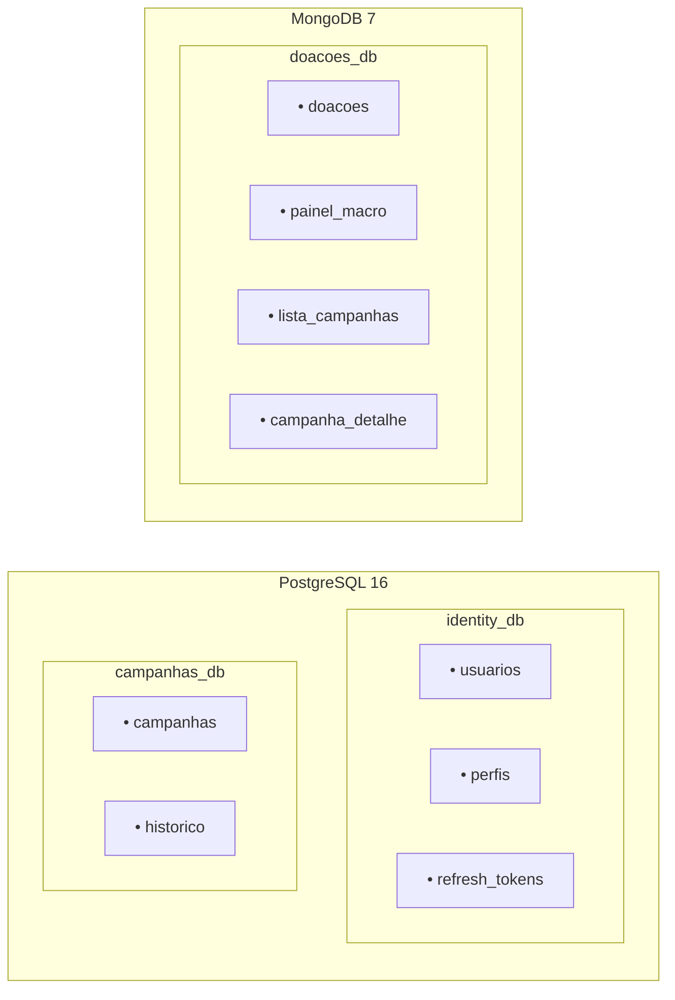

# ADR-04 — Persistência de Dados

> **Data:** Março 2026 · **Status:** ✅ Aceita

---

## Contexto

O Event Storming revelou três agregados com necessidades de persistência distintas:

- **Usuario** (Identidade): dados relacionais com constraints de unicidade (email, CPF), transacionais
- **Campanha** (Campanhas): dados relacionais com máquina de estados, queries de listagem e filtragem
- **Doacao** (Doações): alto volume de escrita, schema flexível, consultas de agregação para transparência

## Decisão

Adotar **persistência poliglota** com dois bancos:

| Banco | Serviço(s) | Database(s) | Justificativa |
|-------|------------|-------------|---------------|
| **PostgreSQL 16** | identity-api, campanhas-api | `identity_db`, `campanhas_db` | Dados relacionais, integridade referencial, constraints de unicidade, transações ACID |
| **MongoDB 7** | worker, campanhas-api (read models) | `doacoes_db` | Schema flexível, aggregation pipeline, alta performance de escrita |

### Distribuição dos Dados

### Read Models de Transparência no MongoDB

Os read models (`painel_macro`, `lista_campanhas`, `campanha_detalhe`) são projeções desnormalizadas armazenadas em collections MongoDB. São atualizados pelo `esperanca-worker` ao processar cada doação.

## Justificativa

1. **PostgreSQL para dados transacionais:** constraints `UNIQUE` para email/CPF, foreign keys, transações ACID, suporte maduro via EF Core + Npgsql
2. **MongoDB para doações:** schema flexível, aggregation pipeline para totais e rankings, write performance superior para o padrão append-only das doações
3. **Read models no MongoDB:** consultas de transparência são desnormalizadas por natureza — MongoDB serve como base de leitura otimizada sem necessidade de ElasticSearch
4. **Uma instância PostgreSQL, dois databases:** reduz custo de infra mantendo isolamento lógico

## Alternativas Consideradas

| Alternativa | Motivo da Rejeição |
|-------------|-------------------|
| **Apenas PostgreSQL** | Doações se beneficiam de MongoDB; modelo relacional forçado seria artificial |
| **ElasticSearch para read models** | Componente complexo; overengineering para o volume do MVP |
| **Apenas MongoDB** | Perda de constraints relacionais para Identity e Campanhas |

## Consequências

- **Positivas:** cada banco otimizado para seu padrão de uso; infra simples (2 serviços de banco)
- **Negativas:** equipe precisa dominar dois paradigmas de persistência; consistência eventual entre PostgreSQL e MongoDB (mitigada pelo design — Worker é a ponte)
