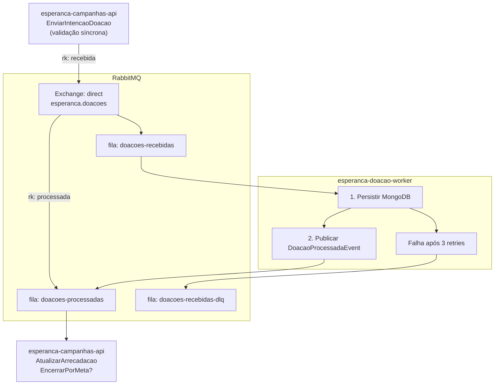

# ADR-05 — Mensageria e Comunicação Assíncrona

> **Data:** Março 2026 · **Status:** ✅ Aceita

---

## Contexto

O Event Storming identificou uma fronteira arquitetural clara entre processamento **síncrono** (API recebe intenção de doação) e **assíncrono** (Worker processa a doação). O evento pivotal `DoacaoRecebida` marca essa transição.

Os hot spots #1 (concorrência no ValorArrecadado), #2 (idempotência) e #7 (política de retry) exigem uma infraestrutura de mensageria resiliente.

## Decisão

Adotar **RabbitMQ 3.13+** como message broker com a seguinte topologia:

### Filas e Exchanges

| Exchange | Tipo | Fila | Producer | Consumer |
|----------|------|------|----------|----------|
| `esperanca.doacoes` | direct | `doacoes-recebidas` | campanhas-api | worker |
| `esperanca.doacoes` | direct | `doacoes-processadas` | worker | campanhas-api |
| `esperanca.doacoes.dlx` | fanout | `doacoes-recebidas-dlq` | RabbitMQ (auto) | — (monitoramento) |

### Fluxo de Mensagens

### Configuração de Resiliência

| Parâmetro | Valor | Justificativa |
|-----------|-------|---------------|
| **Retry count** | 3 tentativas | Balanceio entre resiliência e latência |
| **Backoff** | Exponencial (1s, 4s, 16s) | Evita thundering herd em falhas transientes |
| **DLQ** | `doacoes-recebidas-dlq` | Mensagens que falharam são preservadas para análise |
| **TTL da mensagem** | Sem TTL | Doações validadas devem sempre ser processadas |
| **Prefetch count** | 1 (Worker) | Processamento sequencial para simplificar consistência |
| **ACK mode** | Manual (após persistência + publicação) | Garante at-least-once delivery |

## Justificativa

1. **RabbitMQ** é o broker padrão para .NET — integração nativa via `RabbitMQ.Client`, suporte maduro a DLQ e exchanges tipadas
2. **Exchange direct** com routing keys permite roteamento preciso sem overhead de topic matching
3. **DLQ automática** via Dead Letter Exchange garante que nenhuma mensagem seja perdida silenciosamente
4. **Backoff exponencial** mitiga falhas transientes sem sobrecarregar o broker
5. **ACK manual** garante at-least-once delivery

## Alternativas Consideradas

| Alternativa | Motivo da Rejeição |
|-------------|-------------------|
| **Apache Kafka** | Overengineering para o volume do MVP; model de consumer groups adiciona complexidade desnecessária |
| **Azure Service Bus** | Lock-in com Azure; custo adicional; RabbitMQ roda localmente sem dependência de cloud |
| **Comunicação síncrona (HTTP)** | Acoplamento temporal; falhas na API bloqueariam o processamento de doações |

## Consequências

- **Positivas:** desacoplamento temporal entre API e Worker; resiliência via retry + DLQ; escalabilidade independente do Worker
- **Negativas:** consistência eventual (doação pode levar segundos para refletir no ValorArrecadado); complexidade operacional de monitorar filas e DLQ
