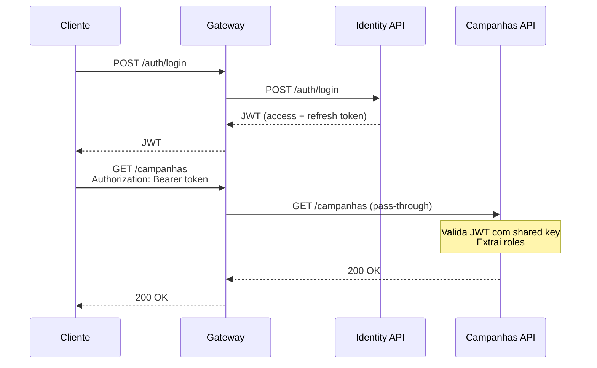

# ADR-06 — Autenticação e Autorização Cross-Service

> **Data:** Março 2026 · **Status:** ✅ Aceita

---

## Contexto

O Event Storming define 3 perfis de acesso — **Admin**, **GestorONG** e **Doador** — com permissões distintas. A autenticação é responsabilidade do `esperanca-identity-api`, mas a autorização precisa ser enforçada no `esperanca-campanhas-api`.

## Decisão

Adotar **JWT (JSON Web Token)** com **shared signing key** e **RBAC (Role-Based Access Control)**:

| Aspecto | Decisão |
|---------|---------|
| **Emissor** | `esperanca-identity-api` emite tokens JWT (access + refresh) |
| **Validação** | Todos os serviços validam o JWT com a mesma signing key simétrica (HMAC-SHA256) |
| **Claims** | `sub` (userId), `email`, `roles` (array: Admin, GestorONG, Doador) |
| **Expiração** | Access token: 30 min; Refresh token: 7 dias |
| **Distribuição da chave** | Kubernetes Secret (`jwt-signing-key`) montado como env var em todos os pods |
| **Autorização** | Atributos `[Authorize(Roles = "GestorONG")]` nos controllers/endpoints |

### Fluxo de Autenticação

### Perfis e Permissões (RBAC)

| Recurso | Admin | GestorONG | Doador | Visitante |
|---------|-------|-----------|--------|-----------|
| Cadastrar usuário | — | — | — | ✅ (público) |
| Autenticar | — | — | — | ✅ (público) |
| Atualizar perfil | ✅ | ✅ | ✅ | — |
| Conceder/Revogar GestorONG | ✅ | — | — | — |
| Criar/Editar/Ativar/Prorrogar/Cancelar Campanha | — | ✅ | — | — |
| Enviar doação | — | ✅* | ✅ | — |
| Consultar transparência | ✅ | ✅ | ✅ | ✅ (público) |

> \* GestorONG acumula perfil Doador, conforme decisão D1 do Event Storming.

## Justificativa

1. **JWT stateless:** cada serviço valida o token sem consultar o Identity API, eliminando acoplamento em tempo de execução
2. **Shared symmetric key:** simples e suficiente para comunicação intra-cluster; a chave nunca sai do Kubernetes
3. **RBAC via claims:** `[Authorize(Roles)]` é nativo do ASP.NET Core, sem bibliotecas adicionais
4. **Admin via seed:** alinhado à decisão D1 do Event Storming — Admin não se cadastra, é criado no migration/seed

## Alternativas Consideradas

| Alternativa | Motivo da Rejeição |
|-------------|-------------------|
| **OAuth2/OIDC (Keycloak, IdentityServer)** | Complexidade operacional desproporcional para 3 serviços internos |
| **Chave assimétrica (RSA/ECDSA)** | Mais seguro para cenários externos; num cluster K8s controlado, a chave simétrica é suficiente |
| **API Key por serviço** | Não suporta claims de usuário; inviável para RBAC |

## Consequências

- **Positivas:** zero latência adicional na validação; nativo do ASP.NET Core; fácil de testar
- **Negativas:** revogação de token não é imediata (mitigado pelo TTL curto de 30 min); chave simétrica deve ser rotacionada periodicamente
