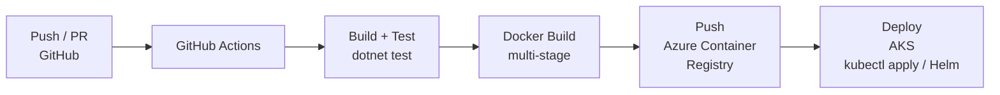

# ADR-09 — Infraestrutura e Deploy

> **Data:** Março 2026 · **Status:** ✅ Aceita

---

## Contexto

O hackathon exige demonstração de deploy em Kubernetes. Para desenvolvimento local, a equipe precisa de um ambiente funcional com todos os serviços, bancos e mensageria rodando localmente.

## Decisão

Adotar **duas estratégias de deploy**:

### Desenvolvimento Local — Docker Compose

```yaml
services:
  postgres:           # PostgreSQL 16 (identity_db + campanhas_db)
  mongodb:            # MongoDB 7 (doacoes_db)
  rabbitmq:           # RabbitMQ 3.13 (management plugin)
  identity-api:       # esperanca-identity-api
  campanhas-api:      # esperanca-campanhas-api
  worker:             # esperanca-worker
  gateway:            # esperanca-gateway-api
```

- Todos os serviços e dependências em um único `docker-compose.yml`
- RabbitMQ Management UI acessível em `localhost:15672`
- Gateway acessível em `localhost:5000`

### Produção — Kubernetes (AKS)

| Componente | Recurso K8s | Réplicas |
|------------|-------------|----------|
| esperanca-identity-api | Deployment + Service (ClusterIP) | 2 |
| esperanca-campanhas-api | Deployment + Service (ClusterIP) | 2 |
| esperanca-worker | Deployment | 1-3 (HPA baseado em queue depth) |
| esperanca-gateway-api | Deployment + Service (LoadBalancer) | 2 |
| PostgreSQL | StatefulSet ou Azure Database for PostgreSQL | 1 |
| MongoDB | StatefulSet ou Azure Cosmos DB (API MongoDB) | 1 |
| RabbitMQ | StatefulSet (com PVC) | 1 |

### CI/CD — GitHub Actions



| Pipeline | Trigger | Ações |
|----------|---------|-------|
| **CI** | Push/PR em qualquer branch | Restore, Build, Test, Lint |
| **CD** | Merge na `main` | CI + Docker Build + Push ACR + Deploy AKS |

## Justificativa

1. **Docker Compose para dev:** paridade máxima com produção; zero instalação local de PostgreSQL/MongoDB/RabbitMQ; onboarding em `docker compose up`
2. **AKS para produção:** requisito do hackathon; scaling automático do Worker via HPA; health checks integrados com readiness/liveness probes
3. **GitHub Actions:** CI/CD nativo do GitHub; sem custo adicional para repos públicos; marketplace com actions para ACR e AKS
4. **Um repo por serviço:** permite CI/CD independente — deploy de um serviço não afeta os outros

## Consequências

- **Positivas:** ambiente local idêntico ao produtivo; deploy automatizado; scaling independente por serviço
- **Negativas:** 4 pipelines de CI/CD para manter; custo de AKS + ACR na Azure (mitigado com free tier / student credits)
