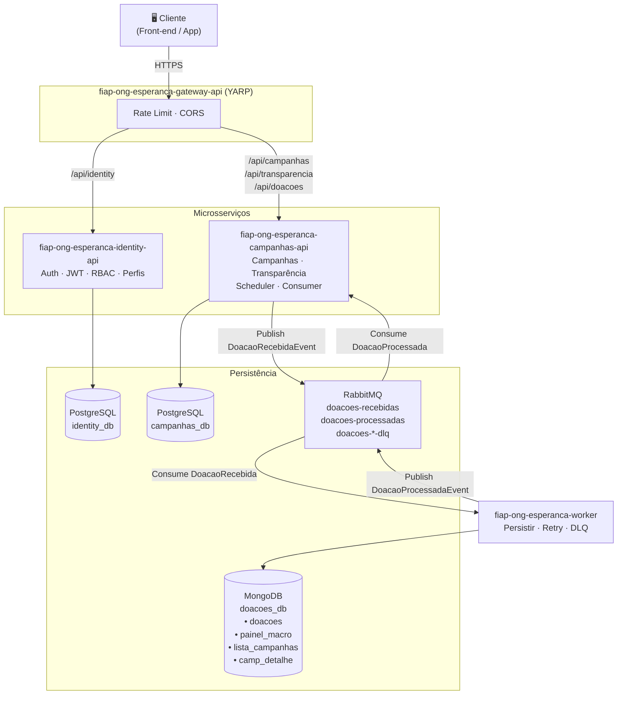

# Arquitetura

Visão macro da plataforma **Conexão Solidária** — 4 microsserviços .NET 10, mensageria RabbitMQ, persistência poliglota e observabilidade completa.

---

## Explore também

-   :material-server-network:{ .lg .middle } **Microsserviços**

    ---

    Detalhamento dos 4 microsserviços: bounded contexts, responsabilidades, endpoints e estrutura de pastas.

    [:octicons-arrow-right-24: Acessar](../microsservicos/index.md)

-   :material-file-document-edit:{ .lg .middle } **Decisões Arquiteturais**

    ---

    10 ADRs documentando cada escolha técnica: stack, divisão de serviços, persistência, mensageria, auth, gateway, observabilidade, infra e testes.

    [:octicons-arrow-right-24: Acessar](../decisoes-arquiteturais/index.md)

---

## Diagrama Arquitetural

---

## Tecnologias e Stack

### Runtime e Framework

| Tecnologia | Versão | Uso |
|------------|--------|-----|
| .NET | 10 | Plataforma de runtime |
| ASP.NET Core | 10 | Web APIs |
| .NET Worker Service | 10 | Processamento em background |
| Entity Framework Core | 10 | ORM (PostgreSQL) |
| MediatR | — | Mediador CQRS (Handlers + Pipelines) |
| FluentValidation | — | Validação de comandos |

### Dados e Mensageria

| Tecnologia | Propósito |
|------------|-----------|
| PostgreSQL 16 | Dados relacionais — `identity_db` e `campanhas_db` |
| MongoDB 7 | Doações e read models de transparência — `doacoes_db` |
| RabbitMQ 3.13 | Message broker — filas de doações e DLQ |

### Segurança

| Tecnologia | Propósito |
|------------|-----------|
| HMAC-SHA256 (JWT) | Autenticação stateless com shared key |
| BCrypt.Net-Next | Hash de senhas |
| YARP Rate Limiting | Proteção contra abuso via fixed window |

### Observabilidade

| Tecnologia | Propósito |
|------------|-----------|
| Serilog | Structured logging (Console + Application Insights) |
| Application Insights | APM — traces, métricas, logs |
| Grafana | Dashboards customizados (RabbitMQ + métricas) |
| ASP.NET Core Health Checks | Readiness/liveness probes para K8s |

### Infraestrutura

| Tecnologia | Uso |
|------------|-----|
| Docker + Docker Compose | Ambiente de desenvolvimento local |
| Kubernetes (AKS) | Orquestração em produção |
| Azure Container Registry (ACR) | Registro de imagens Docker |
| GitHub Actions | CI/CD — build, test, push e deploy |

### Testes

| Tecnologia | Propósito |
|------------|-----------|
| xUnit | Framework de testes |
| NSubstitute / Moq | Mocking |
| Testcontainers | PostgreSQL, MongoDB e RabbitMQ em containers efêmeros para testes de integração |

---

## Mapeamento Event Storming → Serviços

### Agregados → Serviços

| Agregado | Serviço | Banco | Comandos |
|----------|---------|-------|----------|
| **Usuario** | `esperanca-identity-api` | PostgreSQL (`identity_db`) | CadastrarUsuario, Autenticar, AtualizarPerfil, ConcederPerfilGestor, RevogarPerfilGestor |
| **Campanha** | `esperanca-campanhas-api` | PostgreSQL (`campanhas_db`) | CriarCampanha, EditarCampanha, AtivarCampanha, ProrrogarCampanha, CancelarCampanha, VerificarVencimento, EncerrarPorData, AtualizarArrecadacao, EncerrarPorMeta |
| **Doacao** | `esperanca-campanhas-api` (intenção) + `esperanca-worker` (processamento) | MongoDB (`doacoes_db`) | EnviarIntencaoDoacao, PersistirDoacao, SomarValorCampanha, PublicarProcessamento, EnviarParaDLQ |

### Eventos → Serviços

| Evento | Serviço que Emite | Serviço que Consome |
|--------|-------------------|---------------------|
| UsuarioCadastrado | identity-api | — |
| CampanhaCriada | campanhas-api | — |
| CampanhaAtivada | campanhas-api | — |
| **DoacaoRecebidaEvent** | **campanhas-api** | **worker** (via RabbitMQ) |
| DoacaoPersistida | worker | — |
| **DoacaoProcessadaEvent** | **worker** | **campanhas-api** (via RabbitMQ) |
| ProcessamentoDoacaoFalhou | worker | — (DLQ + auditoria) |

> **Negrito:** eventos que trafegam pelo broker (RabbitMQ). Os demais são eventos internos do serviço.
