# Execução

Planejamento e organização do trabalho de desenvolvimento da plataforma **Conexão Solidária** em frentes paralelas para 4 desenvolvedores.

---

## Visão Geral das Frentes

| # | Issue | Responsável | Prioridade | Dependências |
|---|-------|-------------|------------|--------------|
| 1 | Shared Contracts + Docker Compose Infra | Dev 4 | 🔴 Crítica | — |
| 2 | esperanca-identity-api | Dev 1 | 🔴 Crítica | #1 |
| 3 | esperanca-campanhas-api — Domínio e CRUD | Dev 2 | 🔴 Crítica | #1 |
| 4 | esperanca-campanhas-api — Doações e Mensageria | Dev 2 | 🔴 Crítica | #1, #3 |
| 5 | esperanca-campanhas-api — Transparência e Scheduler | Dev 2 | 🟡 Alta | #4 |
| 6 | esperanca-doacao-worker | Dev 3 | 🔴 Crítica | #1 |
| 7 | esperanca-gateway-api (YARP) | Dev 4 | 🟡 Alta | #2, #3 |
| 8 | Docker Compose Full Stack | Dev 4 | 🟡 Alta | #2, #3, #6, #7 |
| 9 | Integração Ponta-a-Ponta | Todos | 🟢 Média | #8 |

---

## Timeline

```mermaid
gantt
    title Cronograma de Desenvolvimento — Conexão Solidária
    dateFormat  WW
    axisFormat  Semana %W

    section Dev 4
    #1 Contracts + Docker Compose Infra   :active, d4_1, 01, 1w
    #7 Gateway YARP                       :active, d4_7, 02, 1w
    #8 Docker Compose Full Stack          :active, d4_8, after d4_7, 4d

    section Dev 1
    #2 Identity — início + testes         :active, d1_2a, 01, 1w
    #2 Identity — conclusão + testes      :active, d1_2b, after d1_2a, 4d
    Buffer / apoio integração             :d1_buf, after d1_2b, 4d

    section Dev 2
    #3 Campanhas CRUD                     :active, d2_3, 01, 1w
    #4 Doações + Mensageria               :active, d2_4, after d2_3, 1w
    #5 Transparência + Scheduler          :active, d2_5, after d2_4, 1w

    section Dev 3
    #6 Worker — início + testes           :active, d3_6a, 01, 1w
    #6 Worker — conclusão + testes        :active, d3_6b, after d3_6a, 1w
    Buffer / apoio integração             :d3_buf, after d3_6b, 4d

    section Todos
    #9 Integração Ponta-a-Ponta           :crit, d_int, 04, 1w
```

---

## Detalhamento das Issues

[:octicons-arrow-right-24: Ver todas as issues](tarefas.md)
