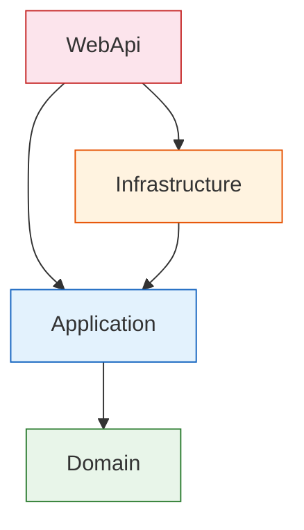
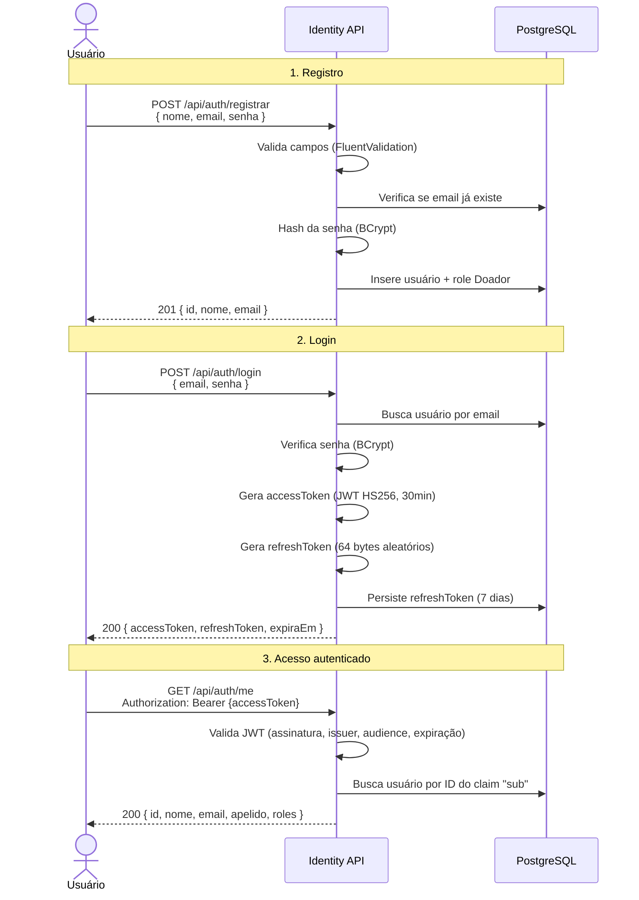
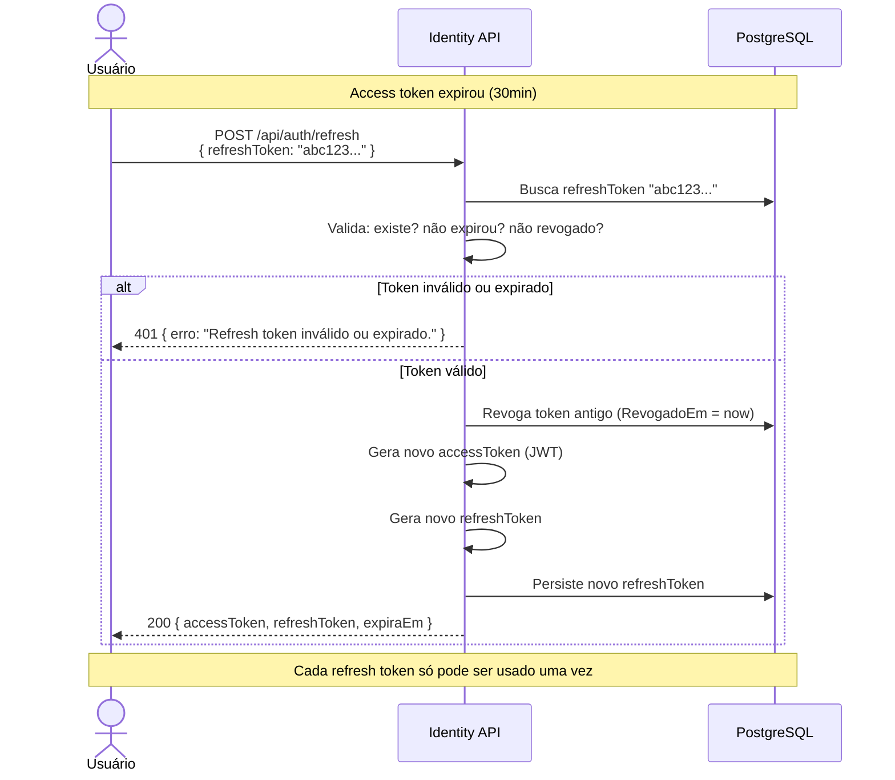
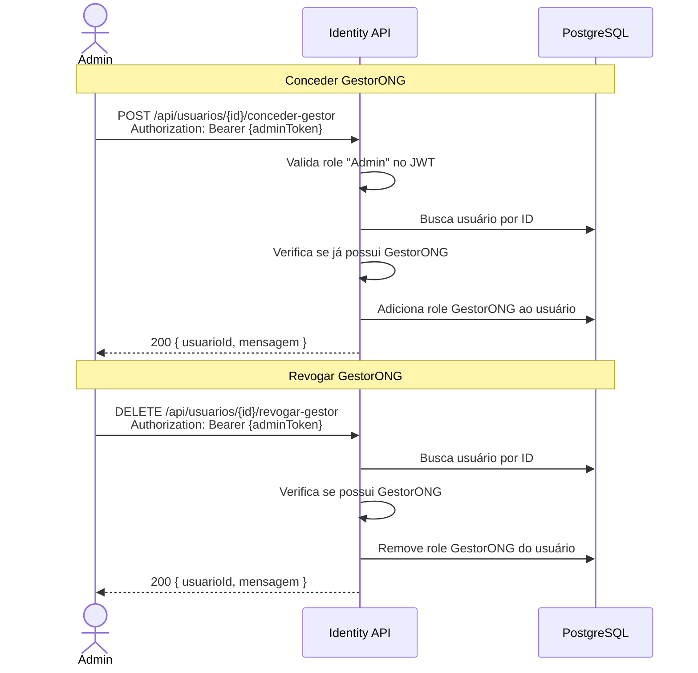
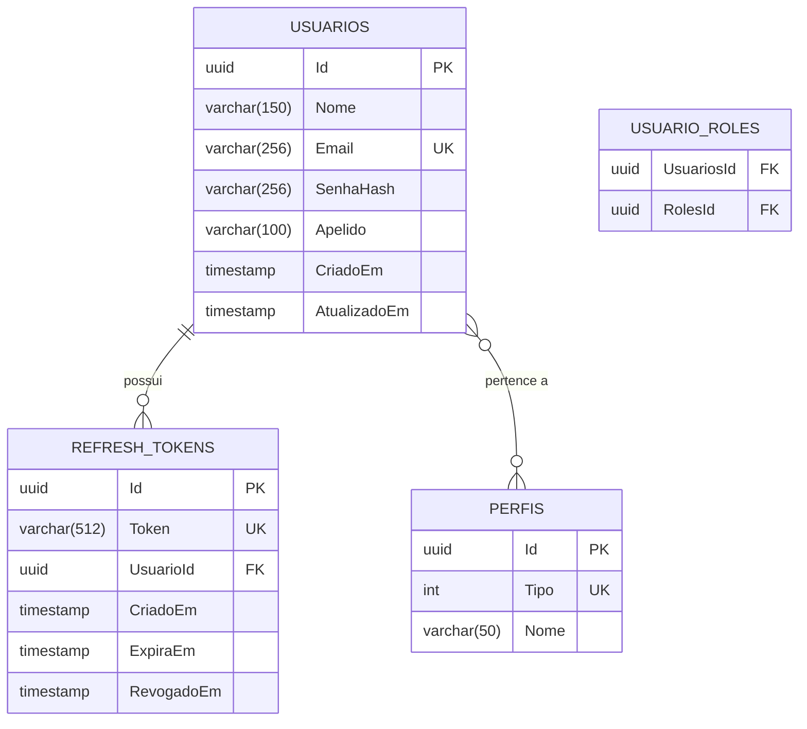

# identity-api

**Repo:** [`fiap-ong-esperanca-identity-api`](https://github.com/fiap-solid-link/fiap-ong-esperanca-identity-api)  
**Tipo:** ASP.NET Core Web API  
**Banco:** PostgreSQL (`identity_db`)  
**Bounded Context:** Identidade e Acesso

## Responsabilidades

- Registro de Doador (público)
- Registro/Seed de GestorONG
- Login (autenticação) → emissão de JWT (access 30min + refresh 7 dias)
- Renovação de tokens (refresh token rotation)
- Validação de token via shared key
- Gerenciamento de perfis/roles (RBAC): Admin, GestorONG, Doador

## Fluxo de Dependências



- **Domain** → zero dependências externas (apenas C# puro)
- **Application** → referencia Domain; define interfaces (`IAppDbContext`, `IJwtService`, `IPasswordHasher`)
- **Infrastructure** → implementa interfaces da Application e Domain
- **WebApi** → orquestra tudo via Modules; controllers delegam ao MediatR

## Endpoints

### Autenticação

| Método | Rota | Acesso | Descrição |
|--------|------|--------|-----------|
| POST | `/api/auth/registrar` | Público | Registro de novo doador |
| POST | `/api/auth/login` | Público | Login → emissão de tokens |
| POST | `/api/auth/refresh` | Público | Renovação de tokens (refresh token rotation) |

### Usuários

| Método | Rota | Acesso | Descrição |
|--------|------|--------|-----------|
| GET | `/api/auth/me` | Autenticado | Perfil do usuário logado |
| PUT | `/api/usuarios/perfil` | Autenticado | Atualizar nome e apelido |
| POST | `/api/usuarios/{id}/conceder-gestor` | Admin | Conceder role GestorONG |
| DELETE | `/api/usuarios/{id}/revogar-gestor` | Admin | Revogar role GestorONG |

### Infraestrutura

| Método | Rota | Acesso | Descrição |
|--------|------|--------|-----------|
| GET | `/health` | Público | Health check (PostgreSQL) |

## Fluxos Principais

### Registro + Login + Acesso Autenticado



### Refresh Token Rotation



### Gestão de Roles (Admin)



## Modelo de Domínio



### Roles (Seed)

| Tipo | Nome | Permissões |
|------|------|------------|
| 1 | Admin | Gerenciar roles de usuários |
| 2 | GestorONG | Gerenciar campanhas (em outro microsserviço) |
| 3 | Doador | Realizar doações e atualizar perfil |

## Autenticação JWT

| Parâmetro | Valor |
|-----------|-------|
| Algoritmo | HMAC-SHA256 |
| Access Token | 30 minutos |
| Refresh Token | 7 dias (uso único) |
| Issuer | `esperanca-identity-api` |
| Audience | `esperanca-platform` |

**Claims do Access Token:**

| Claim | Descrição |
|-------|-----------|
| `sub` | ID do usuário (GUID) |
| `email` | Email do usuário |
| `jti` | ID único do token |
| `role` | Roles do usuário (pode ser múltiplo) |

!!! note "Nota sobre Auth"
    Os demais microsserviços (`campanhas-api`, etc.) validam o JWT usando a mesma chave simétrica (shared secret via ConfigMap/Secret do K8s). Não realizam chamadas ao identity-api em runtime.

## Validações

Todas as mensagens de erro são internacionalizadas (pt-BR e en) via `IAppLocalizer` + embedded JSON resources.

### Registro

| Campo | Regra | Código |
|-------|-------|--------|
| Nome | Obrigatório | `Identity:100` |
| Nome | Máximo 150 caracteres | `Identity:101` |
| Email | Obrigatório | `Identity:102` |
| Email | Formato válido | `Identity:103` |
| Senha | Obrigatória | `Identity:104` |
| Senha | Mínimo 8 caracteres | `Identity:105` |

### Login

| Campo | Regra | Código |
|-------|-------|--------|
| Email | Obrigatório | `Identity:102` |
| Email | Formato válido | `Identity:103` |
| Senha | Obrigatória | `Identity:104` |

### Atualizar Perfil

| Campo | Regra | Código |
|-------|-------|--------|
| Nome | Obrigatório | `Identity:100` |
| Nome | Máximo 150 caracteres | `Identity:101` |
| Apelido | Máximo 100 caracteres | `Identity:106` |

## Seed Automático

Na inicialização, `DatabaseSeed.SeedAdminAsync()` executa automaticamente:

1. Aplica migrations pendentes
2. Verifica se o Admin já existe
3. Se não existir, cria:
    - **Email:** `admin@esperanca.org`
    - **Senha:** `Admin@123`
    - **Role:** Admin

## Códigos de Erro

| Código | Constante | Mensagem (pt-BR) |
|--------|-----------|-------------------|
| `Identity:001` | EmailOuSenhaInvalidos | Email ou senha inválidos. |
| `Identity:002` | TokenInvalido | Token inválido. |
| `Identity:003` | RefreshTokenInvalidoOuExpirado | Refresh token inválido ou expirado. |
| `Identity:004` | EmailJaCadastrado | Email já cadastrado. |
| `Identity:005` | UsuarioNaoEncontrado | Usuário não encontrado. |
| `Identity:006` | UsuarioJaPossuiGestor | Usuário já possui o perfil GestorONG. |
| `Identity:007` | UsuarioNaoPossuiGestor | Usuário não possui o perfil GestorONG. |
| `Identity:008` | RoleGestorNaoEncontrada | Role GestorONG não encontrada. |
| `Identity:900` | ErroDeValidacao | Erro de validação. |

## Dependências Principais

```
.NET 10 · ASP.NET Core · EF Core + Npgsql
MediatR · FluentValidation · BCrypt.Net-Next
Microsoft.AspNetCore.Authentication.JwtBearer
Serilog · Swashbuckle
```
