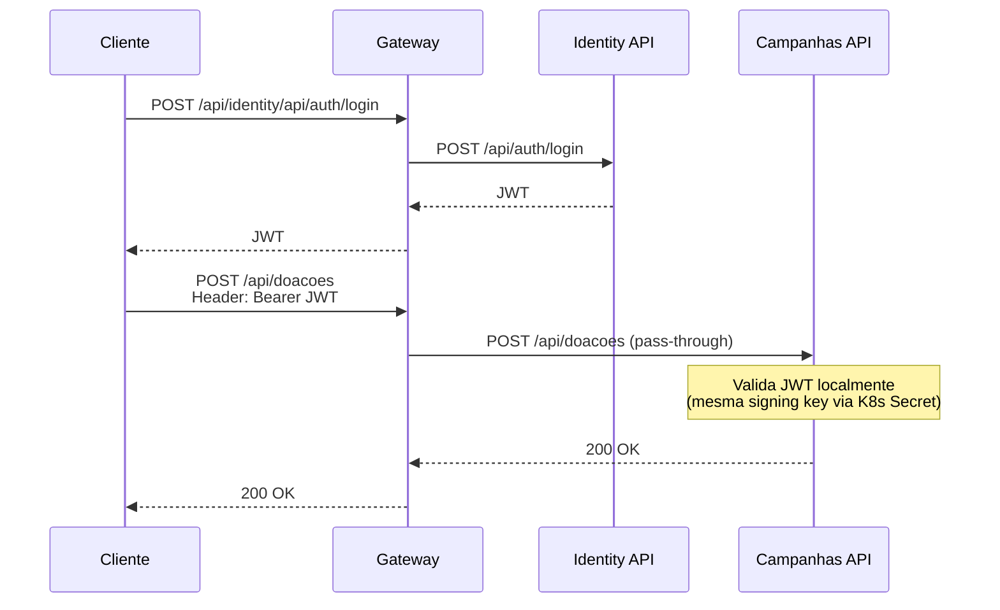

# Microsserviços

4 microsserviços .NET 10 da plataforma **Conexão Solidária** — cada um com bounded context, responsabilidades e repositório dedicado na organização [`fiap-solid-link`](https://github.com/fiap-solid-link).

---

-   :material-shield-account:{ .lg .middle } **fiap-ong-esperanca-identity-api**

    ---

    Autenticação, emissão de JWT e gerenciamento de perfis (RBAC). Bounded context: Identidade e Acesso.

    [:octicons-mark-github-16: GitHub](https://github.com/fiap-solid-link/fiap-ong-esperanca-identity-api) &nbsp;·&nbsp;
    [:octicons-arrow-right-24: Detalhes](fiap-ong-esperanca-identity-api.md)

-   :material-bullhorn:{ .lg .middle } **fiap-ong-esperanca-campanhas-api**

    ---

    CRUD de campanhas, ciclo de vida, intenção de doação e endpoints de transparência. Bounded context: Campanhas + Transparência.

    [:octicons-mark-github-16: GitHub](https://github.com/fiap-solid-link/fiap-ong-esperanca-campanhas-api) &nbsp;·&nbsp;
    [:octicons-arrow-right-24: Detalhes](fiap-ong-esperanca-campanhas-api.md)

-   :material-cog-transfer:{ .lg .middle } **fiap-ong-esperanca-worker**

    ---

    Worker Service que consome eventos de doação do RabbitMQ, persiste no MongoDB e projeta read models de transparência. Bounded context: Doações.

    [:octicons-mark-github-16: GitHub](https://github.com/fiap-solid-link/fiap-ong-esperanca-worker) &nbsp;·&nbsp;
    [:octicons-arrow-right-24: Detalhes](fiap-ong-esperanca-worker.md)

-   :material-transit-connection-variant:{ .lg .middle } **fiap-ong-esperanca-gateway-api**

    ---

    API Gateway (YARP) — ponto único de entrada, roteamento, CORS, rate limiting e health check agregado.

    [:octicons-mark-github-16: GitHub](https://github.com/fiap-solid-link/fiap-ong-esperanca-gateway-api) &nbsp;·&nbsp;
    [:octicons-arrow-right-24: Detalhes](fiap-ong-esperanca-gateway-api.md)

---

## Fluxo de Autenticação Cross-Service

## Perfis e Permissões (RBAC)

| Recurso | Admin | GestorONG | Doador | Visitante |
|---------|-------|-----------|--------|-----------|
| Cadastrar usuário | — | — | — | ✅ (público) |
| Autenticar | — | — | — | ✅ (público) |
| Atualizar perfil | ✅ | ✅ | ✅ | — |
| Conceder/Revogar GestorONG | ✅ | — | — | — |
| Criar/Editar/Ativar/Prorrogar/Cancelar Campanha | — | ✅ | — | — |
| Enviar doação | — | ✅* | ✅ | — |
| Consultar transparência | ✅ | ✅ | ✅ | ✅ (público) |

> \* GestorONG acumula perfil Doador (Decisão D1 do Event Storming).
