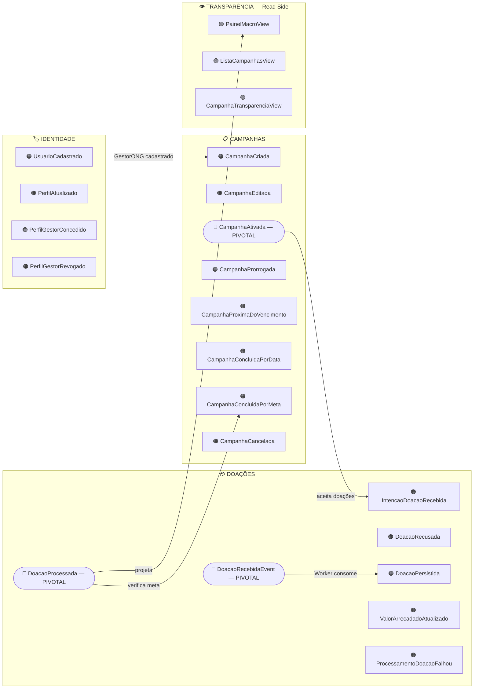
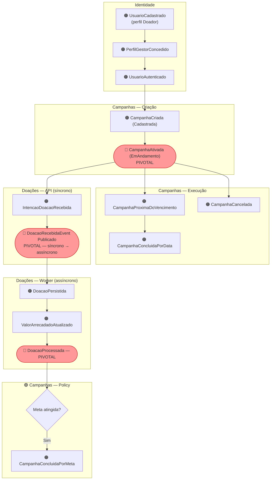
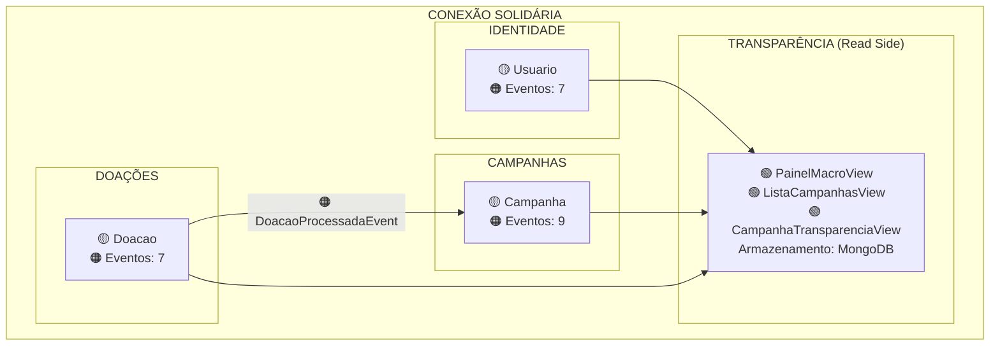
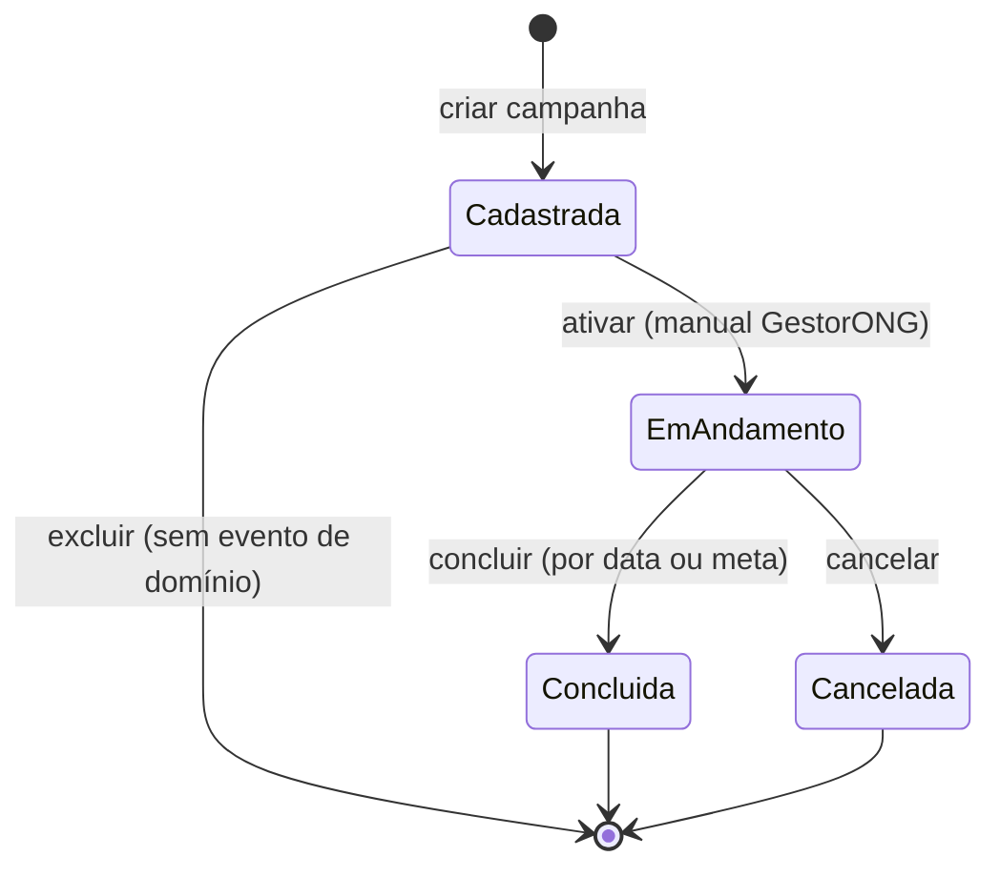

# Event Storming

Modelagem de domínio da plataforma **Conexão Solidária** utilizando **Event Storming** (Alberto Brandolini), do Big Picture até o Design Level.

> **Referência:** Hackathon 9NETT — FIAP

---

## Legenda de Notação

| Elemento | Tipo | Descrição | Exemplo no domínio |
|----------|------|-----------|--------------------|
| 🟠 Laranja | **Domain Event** | Fato relevante que aconteceu no domínio (passado) | `CampanhaAtivada` |
| 🔴 Vermelho | **Hot Spot / Pivotal** | Risco, decisão pendente ou evento de transição entre fases | `DoacaoRecebidaEventPublicado` |
| 🔵 Azul | **Command** | Ação que dispara um evento (imperativo) | `AtivarCampanha` |
| 🟡 Amarelo | **Actor** | Pessoa ou sistema que executa o comando | `GestorONG` |
| 🟣 Lilás | **Policy** | Regra automática que reage a um evento e dispara um comando | `Ao DoacaoProcessada → verificar meta` |
| 🟢 Verde | **Read Model** | Dado projetado para leitura, consumido por um ator para tomar uma decisão | `ListaCampanhasView` |
| 🟡 Amarelo-claro | **Aggregate** | Agrupamento de comandos e eventos com invariantes de domínio | `Campanha` |

---

## Big Picture

### Fase 1 — Domain Events

Eventos de domínio distribuídos por swimlane em ordem temporal. Nós em losango (🔴) são **eventos pivotais** — marcam transição de contexto ou fronteira síncrono/assíncrono.

**Total: 23 Domain Events** — 19 eventos 🟠 + 4 read models 🟢

#### Swimlane: Identidade

| # | 🟠 Domain Event | Descrição |
|---|-----------------|-----------|
| 1 | **UsuarioCadastrado** | Cadastro público realizado. Perfil Doador atribuído automaticamente. Dados: Nome, Email, CPF, Senha (hash) |
| 2 | **PerfilAtualizado** | Usuário atualizou dados do seu perfil (ex.: adicionou Apelido para exibição pública) |
| 3 | **PerfilGestorConcedido** | Admin promoveu usuário existente ao perfil GestorONG (acumula com Doador) |
| 4 | **PerfilGestorRevogado** | Admin revogou o perfil GestorONG de um usuário (volta a ser apenas Doador) |

#### Swimlane: Campanhas

| # | 🟠 Domain Event | Descrição |
|---|-----------------|-----------|
| 8 | **CampanhaCriada** | GestorONG criou nova campanha. Status: Cadastrada. Campos: Título, Descrição, DataInicio, DataFim, MetaFinanceira, ModoEncerramento |
| 10 | **CampanhaEditada** | GestorONG editou dados da campanha. Permitido apenas no status Cadastrada |
| 11 | **CampanhaAtivada** 🔴 | GestorONG ativou a campanha manualmente. Transição: Cadastrada → EmAndamento |
| 12 | **CampanhaProrrogada** | GestorONG estendeu a DataFim da campanha. Permitido apenas em EmAndamento |
| 13 | **CampanhaProximaDoVencimento** | Scheduler detectou campanha EmAndamento com DataFim próxima e meta não atingida |
| 14 | **CampanhaConcluidaPorData** | Scheduler detectou que DataFim expirou. Transição: EmAndamento → Concluida |
| 15 | **CampanhaConcluidaPorMeta** | Domínio detectou ValorArrecadado >= MetaFinanceira. Transição: EmAndamento → Concluida |
| 16 | **CampanhaCancelada** | GestorONG cancelou a campanha. Transição: EmAndamento → Cancelada |

#### Swimlane: Doações

| # | 🟠 Domain Event | Descrição |
|---|-----------------|-----------|
| 17 | **IntencaoDoacaoRecebida** | Doador enviou intenção de doação. Validação da API passou: campanha EmAndamento, data não expirada, meta não atingida |
| 18 | **DoacaoRecusada** | Intenção de doação rejeitada. Motivos: campanha não EmAndamento, meta atingida, data expirada, valor inválido |
| 19 | **DoacaoRecebidaEventPublicado** 🔴 | Pivotal: fronteira síncrono → assíncrono. Evento publicado no RabbitMQ |
| 20 | **DoacaoPersistida** | Worker consumiu a fila e gravou a doação no MongoDB com sucesso |
| 21 | **ValorArrecadadoAtualizado** | Worker somou o valor da doação ao ValorTotalArrecadado da campanha |
| 22 | **DoacaoProcessada** 🔴 | Pivotal: Worker publicou `DoacaoProcessadaEvent` — ciclo assíncrono concluído |
| 23 | **ProcessamentoDoacaoFalhou** | Worker esgotou todas as tentativas de retry. Mensagem enviada para DLQ |

#### Swimlane: Transparência

> Subdomínio de **somente leitura** 🟢. Não gera eventos de domínio — consome **Read Models** projetados a partir dos eventos das outras swimlanes.

---

### Fase 2 — Hot Spots

Pontos de atenção, riscos e decisões identificados durante a modelagem.

| # | 🔴 Hot Spot | Tipo | Status |
|---|-------------|------|--------|
| 1 | **Concorrência no ValorArrecadado** — doações simultâneas processadas pelo Worker podem causar race condition na atualização do total | Risco técnico | Mitigado: aceitar doações acima da meta; consistência eventual |
| 2 | **Idempotência do processamento** — se o Worker falhar após processar mas antes do ACK, a mensagem pode ser reprocessada | Risco técnico | Mitigado: retry com backoff + DLQ + evento `ProcessamentoDoacaoFalhou` |
| 3 | **Validação de CPF** — apenas validação de formato ou consulta de validade real em serviço externo? | Decisão pendente | Validação de formato no MVP |
| 4 | **Hash de senha** — BCrypt obrigatório ou qualquer algoritmo seguro? | Risco de segurança | Resolvido: BCrypt via `BCrypt.Net-Next` |
| 5 | **Bloqueio de conta por tentativas falhas** | Evolução futura | Não modelado no MVP |
| 6 | **Canal de notificação** — `CampanhaProximaDoVencimento` gera notificação, mas por qual canal? | Decisão pendente | Log estruturado no MVP; email via SendGrid como evolução |
| 7 | **Política de retry do Worker** — quantas tentativas? Qual intervalo? | Decisão pendente | Resolvido: 3 tentativas, backoff exponencial (1s, 4s, 16s) |
| 8 | **Latência dos read models** — consistência eventual na projeção MongoDB | Risco técnico | Aceito: latência de segundos é OK para painel público |
| 9 | **Período de "proximidade" do vencimento** — quantos dias antes? | Decisão pendente | Resolvido: 3 dias, configurável via `appsettings.json` |

---

### Fase 3 — Eventos Pivotais e Swimlanes

#### Eventos Pivotais

| 🔴 Evento Pivotal | Tipo de Pivô | Impacto |
|-------------------|--------------|---------|
| **UsuarioCadastrado** | Identidade → Sistema | Habilita o usuário em todos os fluxos subsequentes |
| **CampanhaAtivada** | Negócio | Campanha passa a ser visível no painel e aceita doações |
| **DoacaoRecebidaEventPublicado** | Arquitetural | Fronteira entre processamento **síncrono** (API) e **assíncrono** (Worker) |
| **DoacaoProcessada** | Integração | Pivô entre processamento assíncrono e atualização do domínio de Campanhas |

#### Swimlanes (Bounded Contexts)

| Swimlane | Notação | Eventos | Responsabilidade |
|----------|---------|---------|------------------|
| **Identidade** | 🟠 | #1 – #7 | Registro de usuários, autenticação, gestão de perfis |
| **Campanhas** | 🟠 | #8 – #16 | Criação, edição, ativação, ciclo de vida completo, scheduler |
| **Doações** | 🟠 | #17 – #23 | Intenção de doação, processamento assíncrono, persistência, falhas |
| **Transparência** | 🟢 | *(Read Models)* | Consultas públicas — consome projeções, não gera eventos |

#### Fluxo Temporal Principal

---

## Design Level

### Fase 4 — Comandos, Atores e Políticas

#### 🏷️ Identidade

| 🔵 Comando | 🟡 Ator | 🟣 Política / Regra de Negócio | 🟠 Evento(s) Resultante(s) |
|------------|---------|--------------------------------|---------------------------|
| **CadastrarUsuario** | Visitante | Email único; CPF formato válido; senha com hash; perfil Doador automático | `UsuarioCadastrado` / `CadastroUsuarioRejeitado` |
| **Autenticar** | Visitante | Validar email + senha contra hash armazenado | `UsuarioAutenticado` / `AutenticacaoFalhou` |
| **AtualizarPerfil** | Doador / GestorONG | Campos editáveis; Apelido opcional | `PerfilAtualizado` |
| **ConcederPerfilGestor** | Admin | Usuário-alvo deve existir e não possuir perfil GestorONG | `PerfilGestorConcedido` |
| **RevogarPerfilGestor** | Admin | Usuário-alvo deve possuir perfil GestorONG | `PerfilGestorRevogado` |

#### 📋 Campanhas

| 🔵 Comando | 🟡 Ator | 🟣 Política / Regra de Negócio | 🟠 Evento(s) Resultante(s) |
|------------|---------|--------------------------------|---------------------------|
| **CriarCampanha** | GestorONG | DataFim > agora; MetaFinanceira > 0; ModoEncerramento válido | `CampanhaCriada` / `CriacaoCampanhaRejeitada` |
| **EditarCampanha** | GestorONG | Campanha deve estar no status **Cadastrada** | `CampanhaEditada` |
| **AtivarCampanha** | GestorONG | Campanha deve estar no status **Cadastrada** | `CampanhaAtivada` |
| **ProrrogarCampanha** | GestorONG | Status **EmAndamento**; nova DataFim > DataFim atual | `CampanhaProrrogada` |
| **CancelarCampanha** | GestorONG | Status **EmAndamento** | `CampanhaCancelada` |
| **VerificarVencimento** *(Scheduler)* | Sistema | Campanhas EmAndamento com DataFim próxima e meta não atingida | `CampanhaProximaDoVencimento` |
| **EncerrarPorData** *(Scheduler)* | Sistema | Campanhas EmAndamento com DataFim expirada e modo PorData/PorDataOuMeta | `CampanhaConcluidaPorData` |
| **AtualizarArrecadacao** *(🟣 Policy)* | Sistema | Ao consumir `DoacaoProcessadaEvent` → soma ValorDoacao ao total | `ValorArrecadadoAtualizado` |
| **EncerrarPorMeta** *(🟣 Policy)* | Sistema | ValorArrecadado >= MetaFinanceira e modo PorMeta/PorDataOuMeta | `CampanhaConcluidaPorMeta` |

#### 💳 Doações

| 🔵 Comando | 🟡 Ator | 🟣 Política / Regra de Negócio | 🟠 Evento(s) Resultante(s) |
|------------|---------|--------------------------------|---------------------------|
| **EnviarIntencaoDoacao** | Doador (autenticado) | Campanha **EmAndamento**; ValorDoacao > 0; meta não atingida | `IntencaoDoacaoRecebida` / `DoacaoRecusada` |
| **PublicarNoBroker** *(🟣 Policy)* | Sistema | Após `IntencaoDoacaoRecebida` → publica `DoacaoRecebidaEvent` no RabbitMQ | `DoacaoRecebidaEventPublicado` |
| **PersistirDoacao** *(Worker)* | Sistema | Consome mensagem → grava doação no MongoDB | `DoacaoPersistida` |
| **SomarValorCampanha** *(Worker)* | Sistema | Atualiza ValorTotalArrecadado | `ValorArrecadadoAtualizado` |
| **PublicarProcessamento** *(Worker)* | Sistema | Publica `DoacaoProcessadaEvent` | `DoacaoProcessada` |
| **EnviarParaDLQ** *(Worker)* | Sistema | Após esgotamento de retries → mensagem para DLQ | `ProcessamentoDoacaoFalhou` |

#### 👁️ Transparência — Consultas (Somente Leitura)

| 🔵 Consulta | 🟡 Ator | 🟢 Read Model Consumido |
|-------------|---------|------------------------|
| **ConsultarVisaoMacro** | Visitante / Doador | `PainelMacroView` — total geral + Top 3 doadores |
| **ConsultarListaCampanhas** | Visitante / Doador | `ListaCampanhasView` — ativas primeiro, depois encerradas |
| **ConsultarDetalheCampanha** | Visitante / Doador | `CampanhaTransparenciaView` — detalhe + doações anonimizadas |

---

### Fase 5 — Read Models e Agregados

#### 🟢 Read Models

| 🟢 Read Model | Dados | Fonte de Projeção | Consumidor | Armazenamento |
|---------------|-------|--------------------|------------|---------------|
| **PainelMacroView** | Total geral arrecadado; Top 3 maiores doadores (Apelido ou "Anônimo") | `DoacaoProcessada` + `PerfilAtualizado` | Endpoint público | MongoDB |
| **ListaCampanhasView** | Lista de campanhas: título, meta, valor arrecadado, status, data encerramento | `CampanhaAtivada`, `CampanhaConcluida*`, `CampanhaCancelada`, `ValorArrecadadoAtualizado` | Endpoint público | MongoDB |
| **CampanhaTransparenciaView** | Detalhe da campanha + lista de doações anonimizadas (valor + data) | Eventos de Campanha + `DoacaoPersistida` | Endpoint público | MongoDB |
| **CampanhaGestaoView** | Todos os campos + histórico completo de alterações (auditoria) | Todos os eventos da swimlane Campanhas | GestorONG (autenticado) | PostgreSQL |
| **PerfilUsuarioView** | Nome, Email, CPF, Apelido, lista de perfis | Eventos da swimlane Identidade | Doador / GestorONG / Admin | PostgreSQL |

#### 🟡 Agregado: Usuario

| Aspecto | Detalhe |
|---------|---------|
| **🔵 Comandos** | `CadastrarUsuario`, `Autenticar`, `AtualizarPerfil`, `ConcederPerfilGestor`, `RevogarPerfilGestor` |
| **🟠 Eventos** | `UsuarioCadastrado`, `CadastroUsuarioRejeitado`, `UsuarioAutenticado`, `AutenticacaoFalhou`, `PerfilAtualizado`, `PerfilGestorConcedido`, `PerfilGestorRevogado` |
| **Invariantes** | Email único; CPF válido (11 dígitos + verificadores); senha com hash; Admin via seed; GestorONG acumula perfil Doador |

#### 🟡 Agregado: Campanha

| Aspecto | Detalhe |
|---------|---------|
| **🔵 Comandos** | `CriarCampanha`, `EditarCampanha`, `AtivarCampanha`, `ProrrogarCampanha`, `CancelarCampanha` |
| **🟠 Eventos** | `CampanhaCriada`, `CriacaoCampanhaRejeitada`, `CampanhaEditada`, `CampanhaAtivada`, `CampanhaProrrogada`, `CampanhaProximaDoVencimento`, `CampanhaConcluidaPorData`, `CampanhaConcluidaPorMeta`, `CampanhaCancelada`, `ValorArrecadadoAtualizado` |
| **Invariantes** | DataFim > agora (na criação); MetaFinanceira > 0; transições unidirecionais; edição só em Cadastrada; prorrogação só em EmAndamento com nova DataFim > atual |

#### 🟡 Agregado: Doacao

| Aspecto | Detalhe |
|---------|---------|
| **🔵 Comandos** | `EnviarIntencaoDoacao`, `ProcessarDoacao` |
| **🟠 Eventos** | `IntencaoDoacaoRecebida`, `DoacaoRecusada`, `DoacaoRecebidaEventPublicado`, `DoacaoPersistida`, `DoacaoProcessada`, `ProcessamentoDoacaoFalhou` |
| **Invariantes** | Campanha associada deve estar EmAndamento; ValorDoacao > 0; doações validadas pela API são sempre processadas; falha no Worker após retries resulta em DLQ |

---

## Diagrama de Bounded Contexts

---

## Decisões de Domínio

Decisões tomadas na sessão de descoberta que complementam o documento original do Hackathon.

### D1 — Identidade e Perfis

- **Admin** é pré-cadastrado (seed), não há fluxo de cadastro para este perfil
- **Doador e GestorONG** se cadastram pelo **mesmo fluxo público**
- Todo cadastro público nasce automaticamente com perfil **Doador**
- Admin pode **promover** um usuário a GestorONG (acumula perfis — GestorONG também é Doador)
- Admin pode **revogar** o perfil GestorONG
- Campo **Apelido** é opcional, configurável na edição de perfil (usado para exibição no ranking de transparência; se ausente, exibe "Anônimo")

### D2 — Campanhas: Ciclo de Vida

- **Cadastrada**: estado inicial, todos os campos editáveis
- **EmAndamento**: campanha ativa recebendo doações, só permite **prorrogar DataFim**
- **Concluida**: encerrada (por data, por meta ou ambos), imutável
- **Cancelada**: só a partir de EmAndamento; campanha Cadastrada pode ser excluída/descartada sem evento de domínio
- Transição Cadastrada → EmAndamento é por **ativação manual** do GestorONG

### D3 — Campanhas: Modo de Encerramento

Configurável no cadastro da campanha, com **3 modos**:

| Modo | Comportamento |
|------|---------------|
| **PorData** | Encerra automaticamente quando DataFim expira (scheduler) |
| **PorMeta** | Encerra automaticamente quando ValorArrecadado >= MetaFinanceira |
| **PorDataOuMeta** | Encerra pelo que acontecer primeiro |

- **Scheduler** verifica periodicamente campanhas EmAndamento:
  - DataFim próxima + meta não atingida → gera notificação para gestor prorrogar
  - DataFim expirada → conclui automaticamente (modos PorData e PorDataOuMeta)

### D4 — Doações: Fluxo Completo

1. Doador envia **intenção de doação** (IdCampanha + Valor)
2. API valida: campanha EmAndamento? Meta não atingida conforme critério de encerramento?
3. **Se válida** → publica `DoacaoRecebidaEvent` no broker (RabbitMQ)
4. **Se inválida** → rejeita com justificativa; se motivo for "meta atingida", solicita encerramento da campanha
5. Worker consome a fila → (1) persiste doação no MongoDB → (2) publica `DoacaoProcessadaEvent`
6. Domínio de Campanhas consome `DoacaoProcessadaEvent` → atualiza ValorArrecadado → verifica se meta foi atingida conforme modo de encerramento → se sim, conclui a campanha

### D5 — Doações: Race Condition

- **Doações acima da meta são aceitas** — se a intenção passou pela validação da API, o Worker sempre processa
- Encerramento por meta é verificado reativamente pelo domínio de Campanhas ao consumir `DoacaoProcessadaEvent`

### D6 — Doações: Falhas no Worker

- Worker com **retry/redelivery** (3 tentativas com backoff exponencial)
- Se todas as tentativas falharem → mensagem vai para **DLQ** (Dead Letter Queue)
- Gera evento **ProcessamentoDoacaoFalhou** para auditoria

### D7 — Transparência: Painel Público

- **Visão macro**: total geral arrecadado + Top 3 maiores doadores (exibe Apelido ou "Anônimo")
- **Lista de campanhas**: ativas primeiro, depois encerradas, com meta, total arrecadado, data de encerramento
- **Drill-down por campanha**: lista de doações anonimizadas (valor + data)
- Read models projetados em base indexada para queries otimizadas
